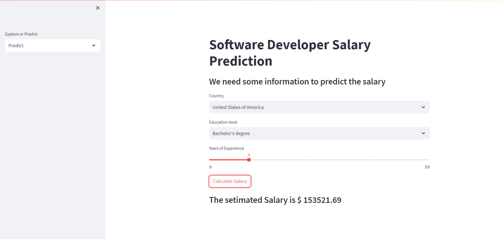
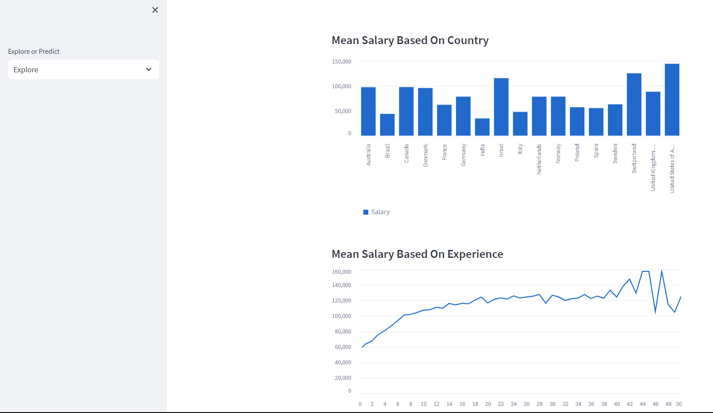

# Web Developer Salary Prediction App :money_with_wings:

This project demonstrates a Machine Learning web application built using Python and Streamlit. The application predicts the salaries of web developers worldwide, utilizing real-world data from the Stack Overflow Developer Survey 2023.

## How It Works

1. **Data Collection**: The survey data is downloaded from [Stack Overflow](https://insights.stackoverflow.com/survey). It contains valuable insights from web developers around the world.

2. **Data Preprocessing**: The downloaded data is cleaned and preprocessed in the `ML_Salary_App.ipynb` notebook. This includes handling missing values, encoding categorical variables, and preparing the dataset for model training.

3. **Model Building**: The `scikit-learn` library is employed to build a Machine Learning model that predicts salaries. This model is trained on features such as country, education level, and years of experience.

4. **Model Validation**: The trained model's performance is validated to ensure accurate predictions. The validation results guide us in refining the model.

5. **Model Persistence**: The validated model is saved as `saved_steps.pkl` for easy reuse without retraining.

6. **Web Application**: The Streamlit framework is used to create the web application. The `app.py` file contains the code for two main pages:
   - **Prediction Page**: Users input their country, education level, and years of experience. The model processes this information and provides an estimated salary prediction.
   - **Statistics Page**: Visualizations showcase salary distribution trends based on the available dataset.


## Screenshots

Here are some screenshots of the Web Developer Salary Prediction App:


*Prediction Page allows users to input information for salary prediction.*


*Explore Page displays salary distribution trends.*

Feel free to explore the app and its functionalities with these screenshots.


## Getting Started

1. Clone the repository and navigate to it:
   ```sh
      git clone https://github.com/OussamaELhansali/Salary_Prediction
      cd Salary_Prediction
   ```
2. Install the required packages:
  ```sh
   pip install -r requirements.txt
  ```
3. Run the Streamlit app:
  ```sh
   streamlit run app.py
  ```
## Contact

For any inquiries, feel free to reach out at [oussamaelhansali@gmail.com](mailto:oussamaelhansali@gmail.com).

Feel free to contact me for any inquiries or feedback regarding this project.
